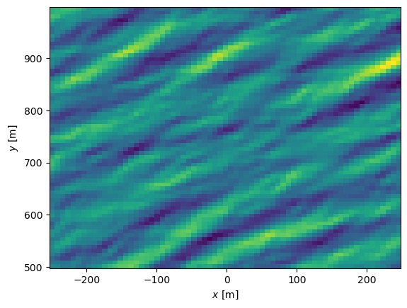

# wave_tools

A framework for working with ocean-wave modelling. Including:

- Construction of wave fields
- Tracking peaks
- Tracking edges
- Detecting wavebreaking (at tracked peaks or close to edges)
- Spectral analysis and filtering
- Interface for writing to file and reading to file by h5py (hdmf)

# Construct a 2D Jonswap wave in space
```python
import numpy as np
from wave_tools import ConstructWave, surface_core, peak_tracking
import matplotlib.pyplot as plt

Hs = 2.0
Alpha = 0.023
smax = 70
theta_mean = np.pi/2+30*np.pi/180
gamma = 3.3
dx = 7.5
dy = 7.5
x = np.arange(-250, 250, dx)
y = np.arange(500, 1000, dy)
surf2d = ConstructWave.JonswapWave2D(x, y, Hs, Alpha, gamma, theta_mean, smax)
surf2d.plot_3d_as_2d()
plt.show()
```


# Filter high frequencies


# Plot the 
