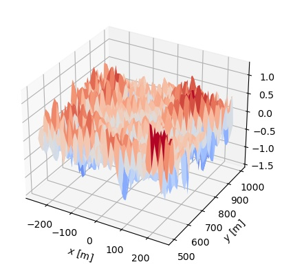

# wave_tools

A framework for working with ocean-wave modelling. Including:

- Construction of wave fields
- Tracking peaks
- Tracking edges
- Detecting wavebreaking (at tracked peaks or close to edges)
- Spectral analysis and filtering
- Interface for writing to file and reading to file by h5py (hdmf)

# Construct a 2D Jonswap wave in space
```python
import numpy as np
from wave_tools import ConstructWave, surface_core, peak_tracking
import matplotlib.pyplot as plt

Hs = 2.0
Alpha = 0.023
smax = 70
theta_mean = np.pi/2+30*np.pi/180
gamma = 3.3
dx = 7.5
dy = 7.5
x = np.arange(-250, 250, dx)
y = np.arange(500, 1000, dy)
surf2d = ConstructWave.JonswapWave2D(x, y, Hs, Alpha, gamma, theta_mean, smax)
surf2d.plot_3d_as_2d()
surf2d.plot_3d_surface()
plt.show()
```



# Convert to Fourier domain
```python
spec2d = surf2d.define_SpectralAnalysis()
# plot the symmetric 2d spectrum
spec2d.plot()
plt.savefig('spec2d.jpg', bbox_inches='tight')
# plot the symmetric 2d spectrum for the given extent
spec2d.plot(extent=[-0.2,0.2,-0.2,0.2])
plt.savefig('spec2d_extent.jpg', bbox_inches='tight')
```


# Filter high frequencies


# Example of shoaling case
Simulates wave shoaling and saves the surface elevation and the horizontal velocity to file

```python
#shoaling
from wave_tools import shoaling_1d
dx = 0.5
x = np.arange(200, 2200+dx, dx)
g = 9.81
Tp = 10
fp = 1./Tp
gam  = 3.3
N_f = 100
f_min = 0.001
f_max = 0.4
F = 300000

# Define Spectrum
DirSpec = shoaling_1d.DirectionalSpectrum(Tp, gam, F)
realization = shoaling_1d.SpectralRealization(DirSpec, f_min, f_max, N_f, dx)

# Define bathymetry
bathy_filename = None
b = shoaling_1d.Bathymetry(x, bathy_filename)
#b.plot()

# Construct wave field from spectrum
Nt = 120
Nx = len(x)
eta = np.zeros((Nt, Nx))
vel = np.zeros((Nt, Nx))
t = np.linspace(0, 12, Nt)

eta = realization.invert(b, t, x)
vel = realization.vel(eta, b,  t, x)
bsurf = surface_core.spacetempSurface('surfprofile', eta, [x, t])
fn = 'example_data/test.hdmf'
bsurf.save(fn, 'eta', False)
bsurf.save_velocity(fn, vel)
```

# Peak tracking
Here we reuse the shoaling case with a different bathymetry over a longer simulation time. The peaks are then tracked and wave breaking is esimated along each peak. We can plot the surface elevation over time and space with all tracked peaks and only the tracks where breaking occurs.

# Plotting the wave along a peak
