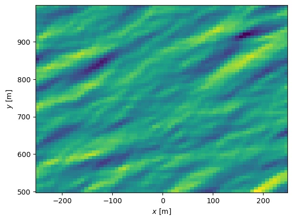
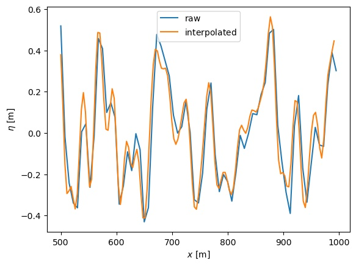
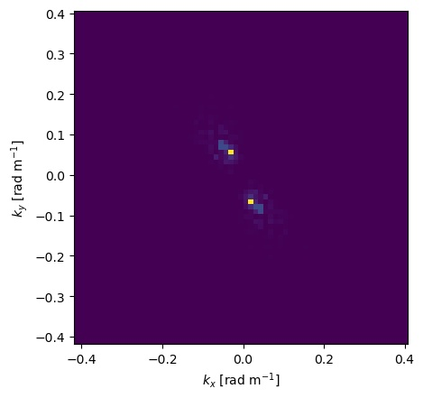
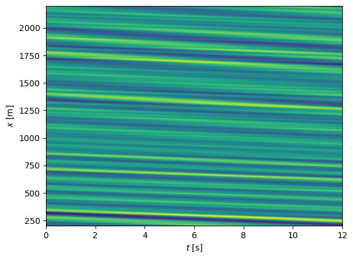
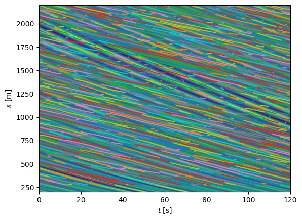
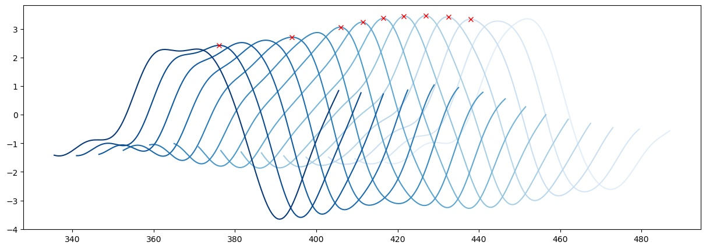

# wave_tools

A framework for working with ocean-wave modelling. Including:

- Construction of wave fields
- Tracking peaks
- Tracking edges
- Detecting wavebreaking (at tracked peaks or close to edges)
- Spectral analysis and filtering
- Interface for writing to file and reading to file by h5py (hdmf)

# Construct a 2D Jonswap wave in space
```python
import numpy as np
from wave_tools import ConstructWave, surface_core, peak_tracking
import matplotlib.pyplot as plt

Hs = 2.0
Alpha = 0.023
smax = 70
theta_mean = np.pi/2+30*np.pi/180
gamma = 3.3
dx = 7.5
dy = 7.5
x = np.arange(-250, 250, dx)
y = np.arange(500, 1000, dy)
surf2d = ConstructWave.JonswapWave2D(x, y, Hs, Alpha, gamma, theta_mean, smax)
surf2d.plot_3d_as_2d()
surf2d.plot_3d_surface()
plt.show()
```
  

# Interpolation based on FFT
The methods achieves a higher resolution by zero filling in the Fourier domain
For each axis one can indicate a factor by which the amount of points should be increased. 
```python
surf2d_interpolated = surf2d.fft_interpolate(2,2)
surf2d_interpolated.plot_3d_as_2d()
plotting_interface.show()
```


# Compare interpolation, plotting along one axis
For better comparison we may extract data points at a given point (here x=10)
```python
y_loc, eta_loc = surf2d.eta_at_xi(10)
y_loc_inter, eta_loc_inter = surf2d_interpolated.eta_at_xi(10)
plotting_interface.plot(y_loc, eta_loc, label=r'$\mathrm{raw}$')
plotting_interface.plot(y_loc_inter, eta_loc_inter, label=r'$\mathrm{interpolated}$')
plotting_interface.label_x_eta()
plotting_interface.legend()
plotting_interface.show()
```


# Finding peaks
Two criteria are implemented. all peaks and peaks between zero crossings.


# Convert to Fourier domain
```python
spec2d = surf2d.define_SpectralAnalysis()
# plot the symmetric 2d spectrum
spec2d.plot()
# plot the symmetric 2d spectrum for the given extent
spec2d.plot(extent=[-0.2,0.2,-0.2,0.2])
plt.show()
```

  

# Filter high frequencies


# Example of shoaling case
At first we have to define some parameters of the wavefield
```python
from wave_tools import shoaling_1d
dx = 0.5
x = np.arange(200, 2200+dx, dx)
g = 9.81
Tp = 10
fp = 1./Tp
gamma  = 3.3
Nf = 100
f_min = 0.001
f_max = 0.4
F = 300000
```


```python
# Create a 1D spectrum and plot it
spec = shoaling_1d.Spectrum(Tp, gamma, F)
spec.plot()
plotting_interface.show()
```


```python
# Define bathymetry
b = shoaling_1d.Bathymetry(x, bathy_filename=None)
b.plot()
plotting_interface.show()
```


```python
# Create a realization with random phases
realization = shoaling_1d.SpectralRealization(spec, f_min, f_max, Nf, dx)

# Construct wave field from spectrum
Nt = 120
Nx = len(x)
eta = np.zeros((Nt, Nx))
vel = np.zeros((Nt, Nx))
t = np.linspace(0, 12, Nt)

eta = realization.invert(b, t, x)
vel = realization.vel(eta, b,  t, x)
bsurf = surface_core.spacetempSurface('surfprofile', eta, [x, t])
bsurf.plot_3d_as_2d()
```


# Save surface to file
The simulated surface elevation and the underlying grid are saved to file in one go. If the horizontal velocity has to be saved seperately. It is not always part of a surface object. The velocity is necessary when peak tracking or edge tracking is desired in order to calculate the wave breaking.
```python
fn = 'example_data/test.hdmf'
bsurf.save(fn, 'eta', False)
bsurf.save_velocity(fn, vel)
```


# Peak tracking
Here we reuse the shoaling case with a different bathymetry over a longer simulation time. The peaks are then tracked and wave breaking is esimated along each peak. We can plot the surface elevation over time and space with all tracked peaks and only the tracks where breaking occurs.

```python
fn = '../PJ_playground/surfprofile'
bsurf = surface_core.surface_from_file(fn, spaceTime=True)
bsurf.load_velocity(fn)
pt = peak_tracking.get_PeakTracker(bsurf.x, bsurf.t, bsurf.eta, bsurf.vel)
ax1 = bsurf.plot_3d_as_2d()
pt.plot_all_tracks(ax=ax1)
ax2 = bsurf.plot_3d_as_2d()
pt.plot_breaking_tracks(ax=ax2)
plt.show()
```

  

# Plotting the wave along a peak
Choose a track a long a peak and plot how the provided data evolves. The extent in x-direction can be specified as well as the time stepping for the evolution. 
```python
ids_breaking_peaks = pt.get_ids_breaking_peaks()
chosen_peak = pt.peaks[ids_breaking_peaks[2]]
chosen_peak.plot_track(bsurf.x, bsurf.t, bsurf.eta, x_extent=70, dt_plot=1., cm_name='Blues', ax=None)
chosen_peak.plot_track_and_mark_breaking(bsurf.x, bsurf.t, bsurf.eta, x_extent=70, dt_plot=1., cm_name='Blues', ax=None)
```

plot_track() marks the peaks. Sometimes multiple peaks can be in the figure and therefore the tracked peak is marked.

Here the peak is marked in with a read cross if the breaking criterion exceeds the threshold (per default Bx>0.85)
